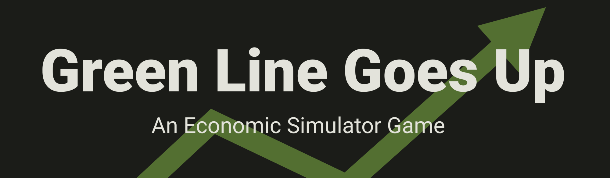

[Marianopolis ArtsFest 2023](https://www.facebook.com/marioartsfest/) · 
[Arts and Sciences Integrative Project](https://www.bemarianopolis.ca/programs/arts-and-sciences/) ·
[MIT License](./LICENSE.md) · 
[Play](https://jerry-licious.github.io/green-line/)

How does the economy work? How do things get made? This game is an economic simulator where you are placed in the shoes 
of a government, managing a small, closed economy and trying to make their GDP go up. You will get to buy goods from 
the markets and use them to improve the productivity of their country. You can control the speed of the simulation to 
monitor it to the last detail: by going through different sections of the game, you will see the well-being and 
preference of each individual in your economy, the price of every type of good on the market, and the performance of 
each firm, all of which will be affected by your actions. On a race against time before inflation makes your investments
worthless, as prices soar with every cent you spend, you must use your money to make good decisions: build the correct 
factories that together become long production chains, upgrade your firms to make them more efficient, and subsidise 
your corporations when they are out of cash. The green line is good. It must go up. 

[Play it now!](https://jerry-licious.github.io/green-line/)

# Requirements

The game *can* be played on any device, so long as the browser version is **at least Firefox or Chrome 67**. Other 
browsers may work, but only these two are explicitly supported and tested for. However, this game is ideally played 
on a **tablet, laptop, or desktop computer** with a large screen. If you are playing on a mobile phone, please tilt 
your screen to better fit the aspect ratio. 

# License

Distributed under the MIT license, please check the [license file](LICENSE.md) for more details.

# Contributing

If you have a bug to report or a suggestion to make, please 
[open a new issue](https://github.com/Jerry-licious/green-line-goes-up/issues/new) and describe your request. 

If you would like to contribute code to the project, please make a fork and submit a pull request!

# Acknowledgements

- Feedback and suggestions from Marianopolis students and professors!
- [Primer](https://www.youtube.com/@PrimerBlobs) for inspiration, [Simply Confusing](https://jasonemerald.wixsite.com/website) for guidance.
- Icon and Graphics Design
  - [Creating Icons with Illustrator](https://www.linkedin.com/learning/creating-icons-with-illustrator/)
  - [Material Theme Builder](https://m3.material.io/theme-builder)
  - [Material Icons](https://fonts.google.com/icons)
  - [Illustrator](https://www.adobe.com/ca/products/illustrator.html), [Icomoon](https://icomoon.io/)
- Dev Tools
  - [Webpack Typescript Starter](https://github.com/juristr/webpack-typescript-starter)
  - [NPM](https://www.npmjs.com/), [webpack](https://webpack.js.org/), [TypeScript](https://www.typescriptlang.org/)
- Dependencies
  - [Chartist](https://gionkunz.github.io/chartist-js/)